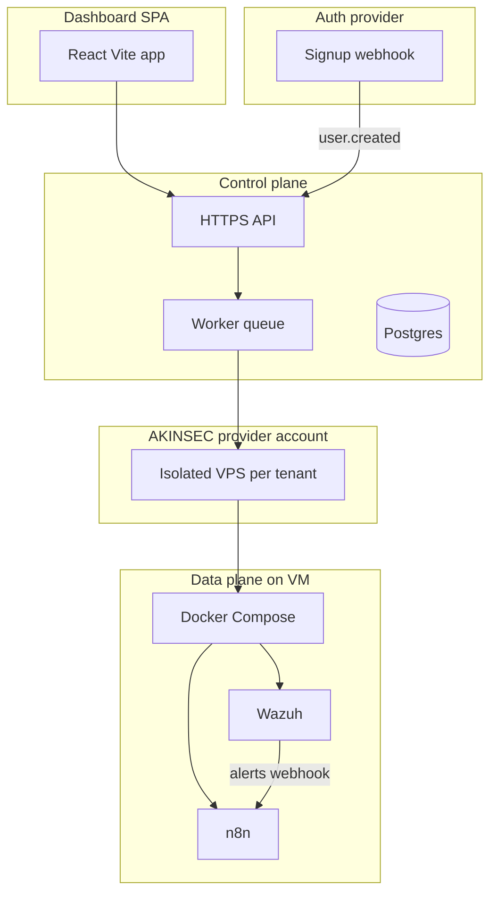

# AKINSEC: SIEM orchestration + self-hosted dashboard

## How the pieces fit together

You already have the right split in [wazuh-n8n/.cursor/plans/siem_orchestration_backend_e5d4b0e2.plan.md](file:///h:/wazuh-n8n/.cursor/plans/siem_orchestration_backend_e5d4b0e2.plan.md):

| Piece                                                       | Role                                                                                                                                                                  |
| ----------------------------------------------------------- | --------------------------------------------------------------------------------------------------------------------------------------------------------------------- |
| **[wazuh-n8n](file:///h:/wazuh-n8n)** (fork)                | Wazuh product changes, optional custom images—**not** where provider billing logic lives                                                                              |
| **Control plane** (new repo or `platform/` sibling)         | Job worker, Postgres, **single org-level provider API token** (secrets manager), bootstrap callback from VPS; maps `tenant_id` → provider `vm_id` (**managed v1**)    |
| **Per-tenant VPS**                                          | Under **your** provider account: one Docker stack per customer VM—**isolation per-VM**; default **1 VPS per customer**, extra VPS only for separate network isolation |
| **Dashboard** ([app-akinsec](h:/AKINSEC/app-akinsec) today) | Browser UI; **Connect cloud** flow; talks **only** to your API—never directly to Wazuh manager API                                                                    |

## What [app-akinsec](h:/AKINSEC/app-akinsec) is today

- **Vite + React** SPA using `@base44/sdk` ([package.json](h:/AKINSEC/app-akinsec/package.json), [src/api/base44Client.js](h:/AKINSEC/app-akinsec/src/api/base44Client.js)).
- Auth and “backend” are **Base44-hosted** ([src/lib/AuthContext.jsx](h:/AKINSEC/app-akinsec/src/lib/AuthContext.jsx), env `VITE_BASE44_`* in [src/lib/app-params.js](h:/AKINSEC/app-akinsec/src/lib/app-params.js)).
- [src/api/entities.js](h:/AKINSEC/app-akinsec/src/api/entities.js) only exposes `Query` plus `User = base44.auth`—a code export does **not** include Base44 cloud database rows; your local loss is mostly test users and any entities only living in Base44.

**Implication:** “Automatic on new user” **requires** a server you deploy that receives a **signup webhook** (or equivalent) and enqueues a provisioning job. Base44 is the wrong long-term anchor for that; migrating self-hosted matches your choice.

## Recommended target architecture (self-hosted)

1. **Control-plane service** (Node/Fastify, Nest, or Python/FastAPI—pick one stack and stay consistent): REST (or tRPC) for the dashboard; internal routes for bootstrap callback from VPS (HMAC or one-time bootstrap token per original plan).
2. **Postgres**: tenants/users (or user IDs from auth provider), `instance` rows with state machine (`requested` → … → `active` / `failed`), provider resource IDs, `tenant_id` → `vm_id`. **v1:** org token lives in env/secrets only—not per-row. Optional future `credential_mode` if BYOI is added later.
3. **Worker + queue**: BullMQ + Redis, or Temporal, or `FOR UPDATE SKIP LOCKED`—same state machine as in the wazuh-n8n plan.
4. **Auth**: Clerk, Auth0, Supabase Auth, or Better Auth—criteria: **signup webhook** (or post-registration action), JWT validation in your API, stable `sub`/user id to map to `tenant_id`.
5. **Dashboard**: Keep the existing React UI where it helps; **replace** `base44` client calls with `fetch`/axios to your API; remove `@base44/sdk` when no longer needed.

Optional: **monorepo** `akinsec/` with `apps/web` (current Vite app), `apps/api` (control plane), `packages/shared` (types, Zod schemas). Not required for v1.

## UX: “Connect cloud” (not “Connect Hostinger”)

Use **provider-agnostic** copy in the dashboard: e.g. **Connect cloud**, **Add infrastructure**, or **Link your VPS provider**—implementation can start with Hostinger only while the UI stays portable for later providers (AWS, DO, etc.).

## Product decision — v1: **managed** (uniform cloud you operate)

**Chosen for v1:** As a **service company** optimizing for customers staying on AKINSEC, you standardize on **one company-controlled provider account**: **you** pay Hostinger (or future providers), **you** provision **one isolated VPS per customer** (default), **customers** pay **you**. Offboarding, data export, and ToS align with **you owning the infra asset**—no BYOI revocation games.

**BYOI** (customer-owned Hostinger accounts) remains documented below **only** as context and a **possible future** tier (e.g. regulated clients); **do not build per-tenant provider tokens in v1** unless you reopen that scope.

### Managed vs BYOI — reference (BYOI deferred)

### Model 1 — Managed (single AKINSEC provider account, many VPS) — **v1**

| Aspect                   | Detail                                                                                                                                                                                                                                                                                                                       |
| ------------------------ | ---------------------------------------------------------------------------------------------------------------------------------------------------------------------------------------------------------------------------------------------------------------------------------------------------------------------------- |
| **How it works**         | One Hostinger (or other) org + **one API token** (stored in your secrets manager). Your worker provisions **one VPS per customer subscription** (default); each VPS runs its own Docker stack—**tenant isolation is per-VM**, not shared processes.                                                                          |
| **Billing**              | **You** pay Hostinger monthly; **customers** pay **you** (SaaS). Margin = subscription minus infra + support.                                                                                                                                                                                                                |
| **Spike / bill shock**   | Real risk if signups spike. **Mitigations:** provision **queue with max concurrency**, **daily/monthly caps**, **waitlist**, **billing alerts** on Hostinger, **manual approval** for large batches, **prepaid capacity** or reserved instances if the provider supports it, and **clear pricing** so growth tracks revenue. |
| **“Stealing” the stack** | The VPS and data live under **your** account; if they cancel your product, you **offboard** (export, delete, or migrate per ToS)—they do not walk away with **your** Hostinger asset unless you transfer it. Legal + product policy matter more than panel tricks.                                                           |
| **Control**              | Full API control as long as you own the token; no dependency on customer revoking access.                                                                                                                                                                                                                                    |

**Multi-VPS per customer:** Product rule: **default 1 VPS per customer**. Allow **2+** only when they need **separate networks / isolation** (e.g. two orgs, air-gapped segments)—model as extra instances with separate state-machine rows and pricing.

### Model 2 — BYOI (customer’s own Hostinger account)

| Aspect                             | Detail                                                                                                                                                                                                                                                                                                                                                                                                                                                                                                                                                                                                      |
| ---------------------------------- | ----------------------------------------------------------------------------------------------------------------------------------------------------------------------------------------------------------------------------------------------------------------------------------------------------------------------------------------------------------------------------------------------------------------------------------------------------------------------------------------------------------------------------------------------------------------------------------------------------------- |
| **How it works**                   | Customer creates a **Hostinger API token** in **their** hPanel (or manual bootstrap: they create the VM, run your script). Your worker uses **that tenant’s token** only for their resources.                                                                                                                                                                                                                                                                                                                                                                                                               |
| **Billing**                        | **Customer** pays Hostinger directly; you may charge only for software/support—or a hybrid.                                                                                                                                                                                                                                                                                                                                                                                                                                                                                                                 |
| **Spike**                          | **Their** bill spikes on **their** account, not yours—your ops cost is support/compute for the control plane, not raw VPS count on your card.                                                                                                                                                                                                                                                                                                                                                                                                                                                               |
| **Revocation / “steal the stack”** | If the VM is in **their** account, **they own the VPS**. They can stop paying **you** and keep the box; revoking **API access** breaks **your automation**, not their ownership of the VM. That’s not “stealing” in a legal sense—it’s **their** infra. Mitigate with **contracts**, **license keys for premium features**, **remote attestation**, or **managed-only** value (updates, SOC, backups) that require your service.                                                                                                                                                                            |
| **Hostinger “Account Sharing”**    | [Account Sharing](https://www.hostinger.com/support/1583777-how-to-share-access-to-your-account-at-hostinger/) lets **another person** access **their** hPanel as a collaborator (with limits: e.g. no changing payment methods, no inviting others—see Hostinger’s doc). It is **not** the same as a clean **multi-tenant API** model: it’s **human** panel access, revocable, and **not** a substitute for “AKINSEC operates my account but I still have credentials.” For **automation**, prefer **API tokens** (BYOI) or **your** account (managed)—not shared panel logins as the primary integration. |

### Model 3 — Hybrid (rare for MVP)

“Customer account but operated only by us” usually still means **either** you hold an API token (BYOI) **or** you use Account Sharing for **support**—it does **not** remove revocation risk if the asset is in their account.

### Practical recommendation (updated)

- **v1:** Implement **Model 1 (managed)** only: one global provider credential, **spike controls**, **1 VPS default**, strong ToS + offboarding.
- **Later (optional):** Model 2 (BYOI) if a segment demands **their** account; that implies different credential storage and legal posture—**separate epic**, not Phase 2 of v1.

**Implementation note (v1):** Worker always uses the **org** API token; tag VMs or metadata with `tenant_id` / internal labels so you never confuse instances. Same bootstrap script and state machine as in the wazuh-n8n plan; **no** per-tenant Hostinger tokens in v1.

### Hostinger / multi-VPS on one account

On **one** Hostinger account you can typically run **many** VPS instances (subject to plan limits and quotas). Each customer VPS is a **separate** VM—**isolation** is at the hypervisor/VM boundary, not “one big shared server,” as long as you don’t colocate tenants in one OS without strong reason. **You** map `tenant_id` → `vm_id` in your DB.

**AWS (later):** If you add AWS under the same **managed** model, you’d use **your** account and separate instances per tenant; cross-account IAM is mainly relevant if you **later** add BYOI.

## Provisioning flow (v1 — managed)

1. **User signs up / subscribes** → auth or billing webhook → `tenant` row. **Connect cloud** in v1 can mean **“your environment is being prepared”** (no customer provider credentials)—enqueue `provision_instance` when policy allows (paid tier, explicit **Add environment**, or queue slot available).
2. **Worker** calls provider API with the **org token**, creates VM labeled for `tenant_id`, attaches **post-install script** (Docker, Compose, callback to control plane—per provider docs).
3. **VPS** runs Wazuh + n8n + **reverse proxy**; Wazuh manager API **not** public to browsers.
4. **Dashboard** shows status; actions go **your API → n8n** with tenant context.

**Cost/product note:** Spikes hit **your** bill—**queues, max concurrency, caps, alerts** are required ops hygiene. Default **1 instance per customer**; second VPS only for **separate network isolation** (product + pricing).

## Phases (do these in order)

**Phase 0 — Manual spike (no automation)**  
On one Hostinger VPS: hand-run Docker Compose (Wazuh + n8n + proxy), prove Wazuh API, n8n API, and alert → n8n webhook. This de-risks everything else. (Matches todo `spike-manual-stack` in your existing plan.)

**Phase 1 — Bootstrap contract**  
Versioned post-install script template + `POST /internal/bootstrap` on control plane + DB schema for instance state + encrypted secrets. Idempotent script. (Matches `bootstrap-contract`.)

**Phase 2 — Provider worker (managed v1)**  
SDK or generated client with **single org token**; state machine + retries + **spike/cancel guardrails**; tenant→VM mapping; dashboard-visible `failed` reason. (Matches `hostinger-worker`.) No BYOI revocation path in v1.

**Phase 3 — Auth migration + API boundary**  
Introduce auth provider + control-plane API; migrate login/session; replace Base44 entity usage with your tables/API. Strip `@base44/sdk` from critical paths. Webhook: on user created → enqueue provision (or mark tenant “pending provision”).

**Phase 4 — Dashboard integration**  
Instance status UI, links to n8n/dashboard via proxy URLs you store per tenant, “prompt” flows through your backend to n8n (matches `dashboard-proxy` in original plan).

**Phase 5 — Hardening**  
TLS, rate limits, manager API exposure rules, secrets rotation checklist (matches `harden-networking`).

## Legal / product reminders (from your doc)

- **n8n** sustainable-use license for some commercial scales—verify against your model before scaling revenue.
- **GPL-2** posture for Wazuh if you distribute images vs only run on your infra—keep counsel in loop for launch.

## Repo locations (clarity)

- **Dashboard app (Base44 export):** [app-akinsec](h:/AKINSEC/app-akinsec) — this Cursor workspace.
- **Marketing / site repo:** [akinsec](file:///H:/Projects/AKINSEC/github%20repo/akinsec) at `H:\Projects\AKINSEC\github repo\akinsec` — separate from the app; link to product/docs and signup; no requirement to merge into app-akinsec for the control plane.
- **Wazuh fork:** [wazuh-n8n](file:///h:/wazuh-n8n) on `H:`.

## What to ignore or defer

- Implementing provisioning **inside** the Wazuh C/C++ tree—your original plan correctly rejects this.
- Treating [Hostinger Account Sharing](https://www.hostinger.com/support/1583777-how-to-share-access-to-your-account-at-hostinger/) as the **primary** integration—it’s **collaborator panel access**, not a substitute for **org API token + managed** provisioning.
- **BYOI** features (per-customer provider tokens, customer-billed VMs) in v1—out of scope until a separate product decision.

## Success criteria (concrete) — v1 managed

- New paid customer → queued job (respecting caps) → new **isolated** VPS under **AKINSEC’s** provider account → `active` → dashboard shows status; **spike controls** prevent unbounded provisions.
- No Wazuh admin credentials in the browser; Wazuh operations only from control plane or n8n on the private Docker network.
- Org-level provider credential in secrets manager only; clear **offboarding** path (export/delete per ToS) since **you** own the VMs.

